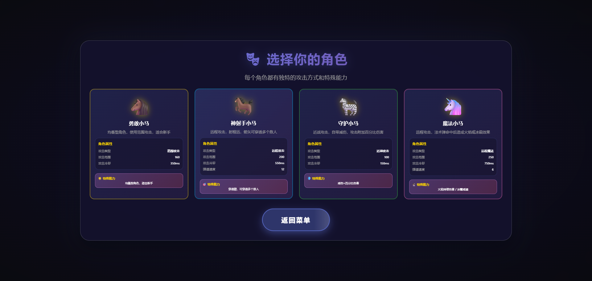
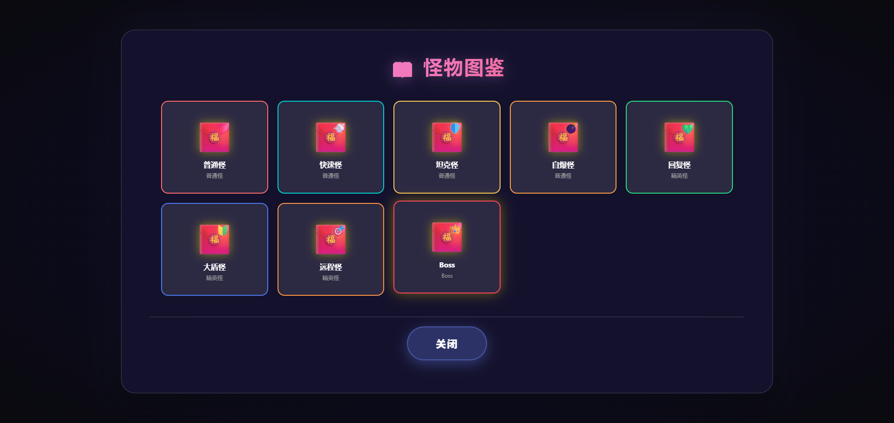
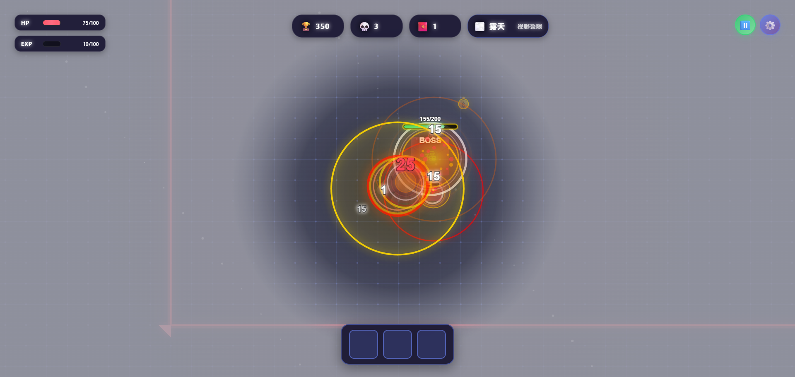
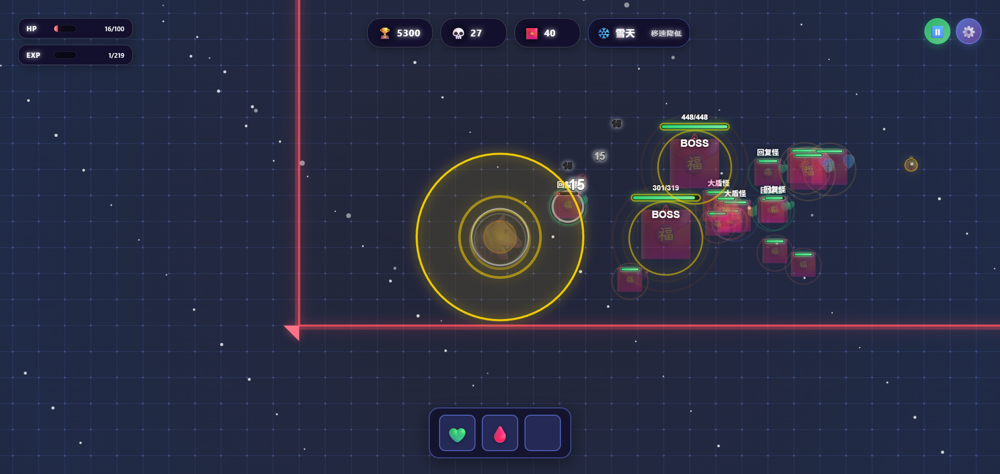
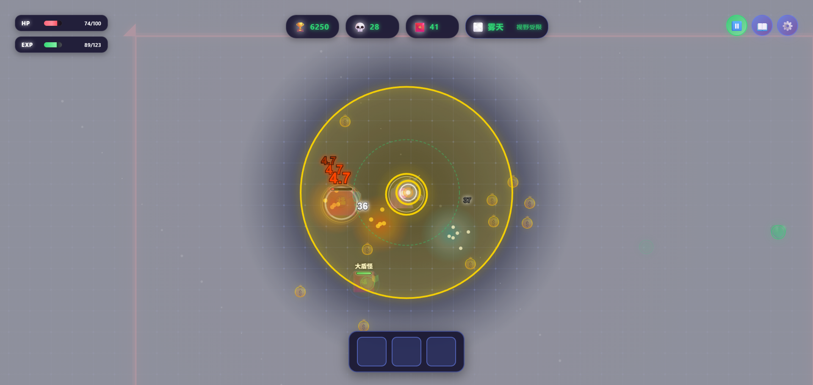
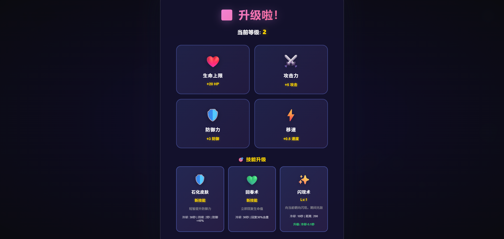
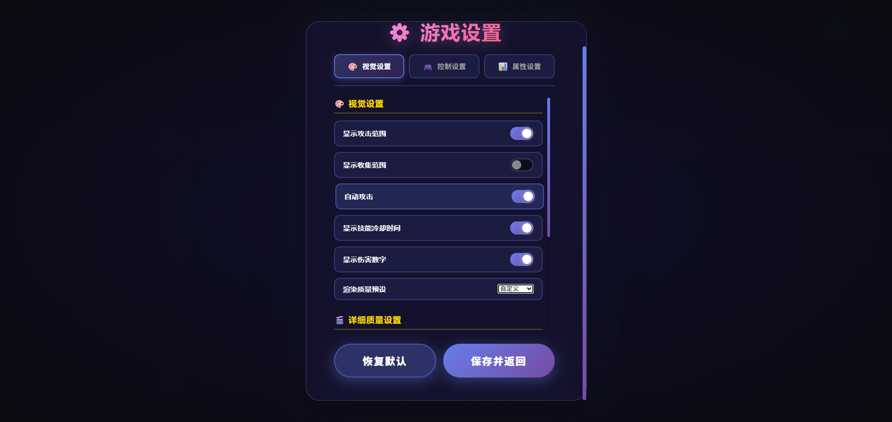
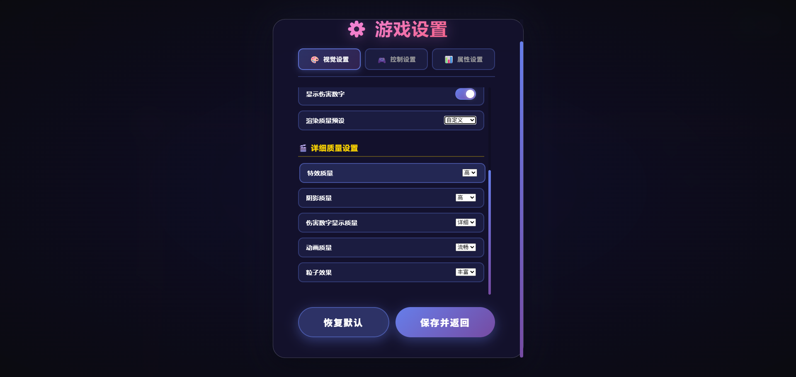
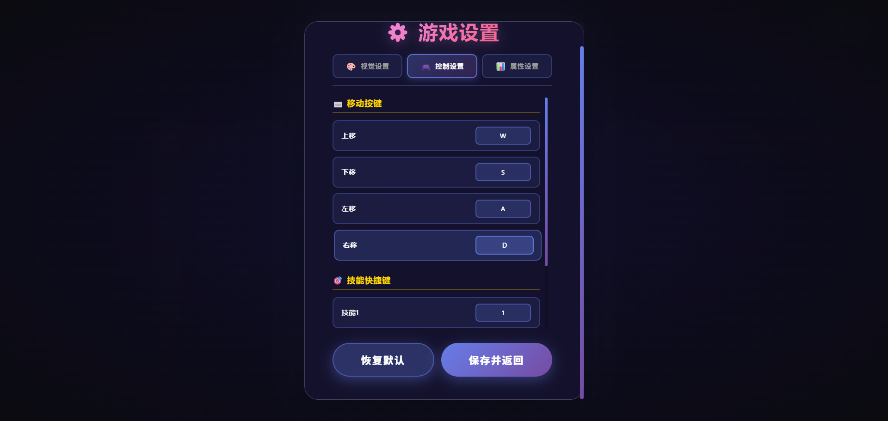
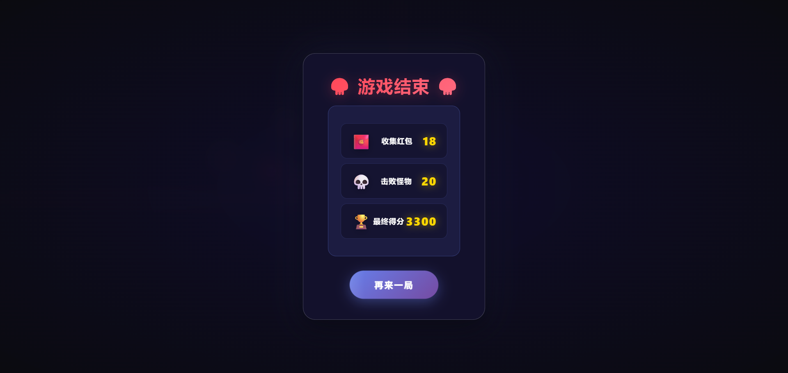

# 🐴 小马红包大作战

<div align="center">

**一款基于HTML/Canvas的暗黑刷宝类生存游戏**

[](https://github.com/204313508/pony-redpacket-survivor)
[](https://github.com/204313508/pony-redpacket-survivor)
[](LICENSE)

[English](#english) | [中文](#中文)

</div>

---

## 中文

### 🎮 游戏简介

《小马红包大作战》是一款受《吸血鬼幸存者》和《土豆兄弟》启发的暗黑刷宝类网页游戏。玩家控制一只小马，在不断涌来的红包怪围攻中生存，击败怪物收集红包，升级强化自己，挑战Boss，获得更高的分数！

### ✨ 游戏特色

- 🎯 **简单易上手** - WASD/方向键移动，鼠标左键攻击
- 🔥 **爽快的战斗体验** - 范围攻击，一次击中多个怪物
- 👹 **Boss挑战** - 每30秒出现强大的Boss，需要多次击败
- 💥 **自爆系统** - 怪物和Boss自爆造成伤害，考验走位
- 🌦️ **动态天气系统** - 每10秒切换天气，影响游戏策略
- ⚔️ **自动攻击系统** - 智能自动攻击范围内敌人，解放双手
- 📈 **RPG成长系统** - 收集红包升级，提升四大属性
- ⚡ **技能系统** - 升级时可选择学习8种强力技能，最多同时使用3个
- 🎨 **精美的视觉效果** - 使用Emoji角色，炫酷的攻击特效
- 🚀 **流畅的游戏体验** - 纯HTML/CSS/JS实现，无需安装
- 💪 **挑战性** - 怪物随时间增强，越玩越刺激

### 🎯 游戏玩法

#### 控制方式

**电脑端**
- **WASD / 方向键** - 移动小马
- **鼠标左键** - 范围攻击
- **收集红包** - 靠近红包自动收集

**移动端**
- **左侧虚拟摇杆** - 移动小马
- **右侧攻击按钮** - 范围攻击
- **收集红包** - 靠近红包自动收集

#### 自动攻击系统
- **默认开启**：游戏默认开启自动攻击功能
- **攻击逻辑**：当有怪物或Boss出现在攻击范围内时，会自动触发攻击
- **攻击限制**：自动攻击遵循正常的攻击间隔（400ms），受攻击冷却影响
- **开关设置**：可在游戏设置中随时开启或关闭自动攻击

#### 升级系统
收集足够的红包（经验）后会触发升级，可以从四个属性中选择一项提升：
- ❤️ **生命上限** - +20 HP，同时恢复20点血量
- ⚔️ **攻击力** - +5 攻击
- 🛡️ **防御力** - +3 防御
- ⚡ **移速** - +0.5 速度

#### 技能系统
升级时有概率出现技能选项，玩家可以学习强力技能来增强战斗能力：
- 💨 **飞毛腿** - 短暂提升移动速度（基础50%，持续2秒，冷却15秒）
- 🔥 **狂热** - 短暂降低攻击间隔，提升攻速（基础50%，持续3秒，冷却30秒）
- 🛡️ **石化皮肤** - 短暂提升防御力（基础40%，持续2秒，冷却30秒）
- 💚 **回春术** - 立即回复生命值（基础30%最大生命，冷却30秒）
- ⚡ **天罚** - 对全屏敌人造成伤害（基础50%最大生命值，冷却60秒）
- 🌟 **回血阵** - 创建持续回血的区域（每秒回复5%生命，持续10秒，冷却45秒）
- 🩸 **嗜血术** - 短暂提升吸血能力（基础10%吸血，持续3秒，冷却20秒）
- ✨ **闪现术** - 向当前朝向闪现，期间无敌（距离200px，冷却10秒）

- 技能可以升级，每次升级会增强技能效果
- 每个玩家最多同时装备3个技能
- 技能释放有冷却时间，合理使用技能组合是关键

#### Boss系统
- **Boss生成**：每30秒生成一个强大的Boss
- **Boss特性**：
  - 比普通怪物更大更强
  - 可以多次自爆，每次自爆扣除自身等量血量
  - 自爆后需要冷却1.5秒
  - Boss死亡后掉落大量红包
- **挑战策略**：灵活走位，利用攻击间隙击败Boss

#### 怪物自爆
- 普通怪物撞击玩家时会自爆，造成伤害
- Boss可以多次自爆，需要多次击败
- 利用走位躲避自爆伤害

#### 天气系统
游戏每10秒随机切换一种天气，每种天气都有独特的效果：

**☀️ 晴天**
- 攻击力提升（+5 或 +5%，取高值）
- 温暖的阳光效果
- 适合快速击败怪物

**💨 风天**
- 移动速度提升（+0.5 或 +2%，取高值）
- 飘逸的风线效果
- 适合快速移动和躲避

**🌧️ 雨天**
- 每隔2秒在地图随机位置生成一个回复包（💚）
- 回复包存在10秒，小马踩到后回复生命值（10点或10%最大生命，取高值）
- 暴雨效果，需要注意收集回复包

**⛈️ 雷天**
- 每隔1.25秒在地图随机100范围内出现雷击
- 雷击有预警圈（范围圈+逐渐变大的实心内圈，预警持续1秒）
- 被雷击击中的单位（玩家、怪物、Boss）受到伤害（30点或10%最大生命，取高值）
- 闪电效果震撼，需要快速躲避

**🌫️ 雾天**
- 只渲染玩家附近的红包（400px范围内）
- 其他地方用雾气特效遮盖
- 降低视野范围，考验记忆和探索

**❄️ 雪天**
- 移动速度降低2%
- 飘雪效果增加氛围
- 需要更谨慎地规划移动路线

#### 游戏目标
- 尽可能长时间生存
- 击败更多红包怪和Boss
- 收集更多红包
- 获得更高分数

### 🚀 快速开始

#### 在线游玩
直接用浏览器打开 `index.html` 文件即可开始游戏！

#### 本地运行
```bash
# 克隆仓库
git clone https://github.com/204313508/pony-redpacket-survivor.git

# 进入目录
cd pony-redpacket-survivor

# 用浏览器打开 index.html
open index.html  # macOS
start index.html # Windows
xdg-open index.html # Linux
```

#### 使用本地服务器（推荐）
```bash
# 使用 Python 3
python -m http.server 8000

# 使用 Node.js
npx http-server

# 然后访问 http://localhost:8000
```

### 🛠️ 技术栈

- **HTML5** - 页面结构
- **CSS3** - 样式和动画
- **JavaScript (ES6+)** - 游戏逻辑
- **Canvas API** - 游戏渲染
- **requestAnimationFrame** - 动画循环

### 📁 项目结构

```
pony-redpacket-survivor/
├── index.html          # 游戏主页面
├── style.css           # 样式文件
├── game.js             # 游戏逻辑
├── README.md           # 项目说明
└── sounds/             # 音频文件夹
```

### 🎮 游戏截图

#### 游戏开始界面
<div align="center">
  
</div>

#### 角色选择界面
<div align="center">
  
</div>

#### 怪物图鉴
<div align="center">
  
</div>

#### 游戏战斗场景 1
<div align="center">
  
</div>

#### 游戏战斗场景 2
<div align="center">
  
</div>

#### 游戏战斗场景 3
<div align="center">
  
</div>

#### Boss战斗
<div align="center">
  
</div>

#### 升级界面
<div align="center">
  
</div>

#### 设置界面 - 视觉设置
<div align="center">
  
</div>

#### 设置界面 - 渲染质量
<div align="center">
  
</div>

#### 设置界面 - 控制设置
<div align="center">
  
</div>

#### 游戏结束界面
<div align="center">
  
</div>

#### 移动端界面 - 游戏开始
<div align="center">
  
</div>

### 📊 游戏参数

#### 玩家初始属性
| 属性 | 数值 |
|------|------|
| 生命值 | 100 |
| 攻击力 | 15 |
| 防御力 | 5 |
| 移速 | 4 |
| 攻击范围 | 160px |
| 攻击冷却 | 400ms |

#### 怪物属性
| 属性 | 数值 |
|------|------|
| 初始生命 | 30 |
| 初始攻击 | 10 |
| 初始速度 | 1.8 |
| 生成间隔 | 1.5秒 |
| 最大数量 | 30 |

#### Boss属性
| 属性 | 数值 |
|------|------|
| 初始生命 | 200 |
| 攻击力 | 20 |
| 移速 | 2.2 |
| 大小 | 60px |
| 生成间隔 | 30秒 |
| 自爆伤害 | 30 |
| 自爆冷却 | 1.5秒 |
| 死亡掉落红包 | 15个 |

#### 难度成长
- 每30秒难度增加 0.5倍
- 怪物属性随难度增强
- 生成数量随难度增加
- Boss属性也随难度增强

#### 移动端补偿参数
| 参数 | 数值 | 说明 |
|------|------|------|
| 速度系数 | 0.45 | 移动端速度降低，以便更精确控制 |
| 攻击范围系数 | 1.1 | 移动端攻击范围增大 |
| 收集范围系数 | 1.3 | 移动端收集范围增大（确保收集范围比攻击范围大） |
| 摄像机缩放 | 0.85 | 移动端摄像机缩小视野，让玩家看到更大区域 |
| 元素显示大小倍数 | 1.15 | 移动端元素显示增大，让元素更容易看清 |
| 红包收集速度系数 | 0.6 | 移动端红包收集速度降低 |

### 🎯 得分规则

- 击败普通怪物：+100分
- 击败Boss：+500分
- 收集红包：+50分
- 最终得分 = 普通击杀数×100 + Boss击杀数×500 + 收集数×50

### 🐛 已知问题

- 游戏在低性能设备上可能会有卡顿
- 部分旧版浏览器可能不支持Canvas API

---

## English

### 🎮 Game Introduction

**Pony Red Packet Survivor** is a dark survival roguelike web game inspired by *Vampire Survivors* and *Potato Bros*. Control a pony, survive against waves of red packet monsters, collect red packets to level up, challenge powerful Bosses, and achieve a higher score!

### ✨ Game Features

- 🎯 **Easy to Play** - WASD/Arrow keys to move, Mouse to attack
- 🔥 **Exciting Combat** - Area-of-effect attacks, hit multiple enemies at once
- 👹 **Boss Challenges** - Powerful Bosses appear every 30 seconds, requiring multiple defeats
- 💥 **Explosion System** - Monsters and Bosses explode on impact, dealing damage
- 🌦️ **Dynamic Weather System** - Weather changes every 10 seconds, affecting gameplay strategy
- ⚔️ **Auto-Attack System** - Smartly attacks enemies in range, hands-free gameplay
- 📈 **RPG Progression** - Collect red packets to level up and upgrade stats
- ⚡ **Skill System** - Choose from 8 powerful skills when leveling up, equip up to 3 skills
- 🎨 **Beautiful Visuals** - Emoji-based characters, cool attack effects
- 🚀 **Smooth Experience** - Pure HTML/CSS/JS, no installation needed
- 💪 **Challenging** - Monsters get stronger over time

### 🎯 How to Play

#### Controls

**Desktop**
- **WASD / Arrow Keys** - Move pony
- **Mouse Left Click** - Area attack
- **Collect Red Packets** - Get close to collect automatically

**Mobile**
- **Left Virtual Joystick** - Move pony
- **Right Attack Button** - Area attack
- **Collect Red Packets** - Get close to collect automatically

#### Auto-Attack System
- **Default Enabled**: Auto-attack is enabled by default
- **Attack Logic**: Automatically attacks when monsters or Bosses are within attack range
- **Attack Limitation**: Auto-attack respects normal attack cooldown (400ms)
- **Toggle Setting**: Can be enabled or disabled in game settings at any time

#### Upgrade System
Collect enough red packets (EXP) to level up, choose from four stats:
- ❤️ **Max HP** - +20 HP, also heals 20 HP
- ⚔️ **Attack Power** - +5 Attack
- 🛡️ **Defense** - +3 Defense
- ⚡ **Movement Speed** - +0.5 Speed

#### Skill System
When leveling up, skill options may appear. Players can learn powerful skills to enhance combat abilities:
- 💨 **Fleet Foot** - Temporarily boost movement speed (base 50%, 2s duration, 15s cooldown)
- 🔥 **Frenzy** - Temporarily reduce attack cooldown, boost attack speed (base 50%, 3s duration, 30s cooldown)
- 🛡️ **Stone Skin** - Temporarily boost defense (base 40%, 2s duration, 30s cooldown)
- 💚 **Heal** - Instantly restore health (base 30% max HP, 30s cooldown)
- ⚡ **Sky Punishment** - Deal damage to all enemies on screen (base 50% max HP damage, 60s cooldown)
- 🌟 **Heal Field** - Create a healing area (heals 5% HP per second, 10s duration, 45s cooldown)
- 🩸 **Bloodthirst** - Temporarily boost lifesteal ability (base 10% lifesteal, 3s duration, 20s cooldown)
- ✨ **Blink** - Teleport in current direction, invincible during teleport (200px distance, 10s cooldown)

- Skills can be upgraded, each level enhances the skill effect
- Each player can equip up to 3 skills simultaneously
- Skills have cooldown times, using skill combinations wisely is key

#### Boss System
- **Boss Spawn**: A powerful Boss appears every 30 seconds
- **Boss Features**:
  - Larger and stronger than normal monsters
  - Can explode multiple times, losing HP equal to explosion damage
  - 1.5 second cooldown after explosion
  - Drops many red packets upon death
- **Strategy**: Use positioning wisely, defeat Bosses during cooldown windows

#### Monster Explosions
- Normal monsters explode on impact, dealing damage
- Bosses can explode multiple times and require multiple defeats
- Dodge explosion damage with good positioning

#### Weather System
The game randomly switches between weather types every 10 seconds, each with unique effects:

**☀️ Sunny**
- Attack Power boosted (+5 or +5%, whichever is higher)
- Warm sunlight effects
- Ideal for quickly defeating enemies

**💨 Windy**
- Movement Speed boosted (+0.5 or +2%, whichever is higher)
- Graceful wind line effects
- Perfect for fast movement and dodging

**🌧️ Rainy**
- Health potions (💚) spawn at random locations every 2 seconds
- Potions last for 10 seconds, heal HP (10 or 10% max HP, whichever is higher) when collected
- Rainstorm effects, keep an eye out for health potions

**⛈️ Stormy**
- Lightning strikes random 100-radius areas every 1.25 seconds
- Lightning has warning circles (outer range + expanding inner circle, 1 second warning)
- Units hit by lightning (player, monsters, Bosses) take damage (30 or 10% max HP, whichever is higher)
- Impressive lightning effects, requires quick dodging

**🌫️ Foggy**
- Only renders red packets near the player (within 400px range)
- Other areas are covered with fog effects
- Reduces visibility,考验 memory and exploration

**❄️ Snowy**
- Movement Speed reduced by 2%
- Snow falling effects add atmosphere
- Requires more careful movement planning

#### Goal
- Survive as long as possible
- Defeat more red packet monsters and Bosses
- Collect more red packets
- Get a higher score

### 🚀 Quick Start

#### Play Online
Just open `index.html` in your browser and start playing!

#### Local Setup
```bash
# Clone the repository
git clone https://github.com/204313508/pony-redpacket-survivor.git

# Navigate to directory
cd pony-redpacket-survivor

# Open index.html in browser
open index.html  # macOS
start index.html # Windows
xdg-open index.html # Linux
```

#### Using Local Server (Recommended)
```bash
# Using Python 3
python -m http.server 8000

# Using Node.js
npx http-server

# Then visit http://localhost:8000
```

### 🛠️ Tech Stack

- **HTML5** - Page structure
- **CSS3** - Styles and animations
- **JavaScript (ES6+)** - Game logic
- **Canvas API** - Game rendering
- **requestAnimationFrame** - Animation loop

### 📁 Project Structure

```
pony-redpacket-survivor/
├── index.html          # Main page
├── style.css           # Styles
├── game.js             # Game logic
├── README.md           # Project documentation
└── sounds/             # Sound effects folder
```

### 🎮 Game Screenshots

#### Game Start Screen
<div align="center">
  
</div>

#### Character Selection Screen
<div align="center">
  
</div>

#### Monster Gallery
<div align="center">
  
</div>

#### Gameplay Scene 1
<div align="center">
  
</div>

#### Gameplay Scene 2
<div align="center">
  
</div>

#### Gameplay Scene 3
<div align="center">
  
</div>

#### Boss Combat
<div align="center">
  
</div>

#### Upgrade Screen
<div align="center">
  
</div>

#### Settings Screen - Visual Settings
<div align="center">
  
</div>

#### Settings Screen - Rendering Quality
<div align="center">
  
</div>

#### Settings Screen - Control Settings
<div align="center">
  
</div>

#### Game Over Screen
<div align="center">
  
</div>

#### Mobile Screens - Game Start
<div align="center">
  
</div>

### 📊 Game Parameters

#### Player Initial Stats
| Stat | Value |
|------|-------|
| Health | 100 |
| Attack Power | 15 |
| Defense | 5 |
| Movement Speed | 4 |
| Attack Range | 160px |
| Attack Cooldown | 400ms |

#### Monster Stats
| Stat | Value |
|------|-------|
| Initial HP | 30 |
| Initial Attack | 10 |
| Initial Speed | 1.8 |
| Spawn Interval | 1.5s |
| Max Count | 30 |

#### Boss Stats
| Stat | Value |
|------|-------|
| Initial HP | 200 |
| Attack Power | 20 |
| Movement Speed | 2.2 |
| Size | 60px |
| Spawn Interval | 30s |
| Explosion Damage | 30 |
| Explosion Cooldown | 1.5s |
| Red Packet Drop | 15 |

#### Difficulty Progression
- Difficulty increases by 0.5x every 30 seconds
- Monster stats scale with difficulty
- Spawn count increases with difficulty
- Boss stats also scale with difficulty

#### Mobile Compensation Parameters
| Parameter | Value | Description |
|-----------|-------|-------------|
| Speed Multiplier | 0.45 | Reduced speed for mobile for more precise control |
| Attack Range Multiplier | 1.1 | Increased attack range on mobile |
| Collect Range Multiplier | 1.3 | Increased collect range on mobile (ensures collect range is larger than attack range) |
| Camera Zoom | 0.85 | Smaller camera view on mobile for larger visible area |
| Element Scale Multiplier | 1.15 | Larger element display on mobile for better visibility |
| Red Packet Collect Speed Multiplier | 0.6 | Reduced red packet collect speed on mobile |

### 🎯 Scoring Rules

- Defeat normal monster: +100 points
- Defeat Boss: +500 points
- Collect red packet: +50 points
- Final Score = Normal Kills × 100 + Boss Kills × 500 + Collections × 50

### 🐛 Known Issues

- Game may lag on low-performance devices
- Some older browsers may not support Canvas API