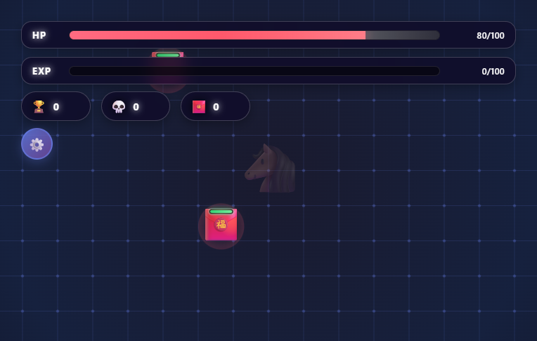
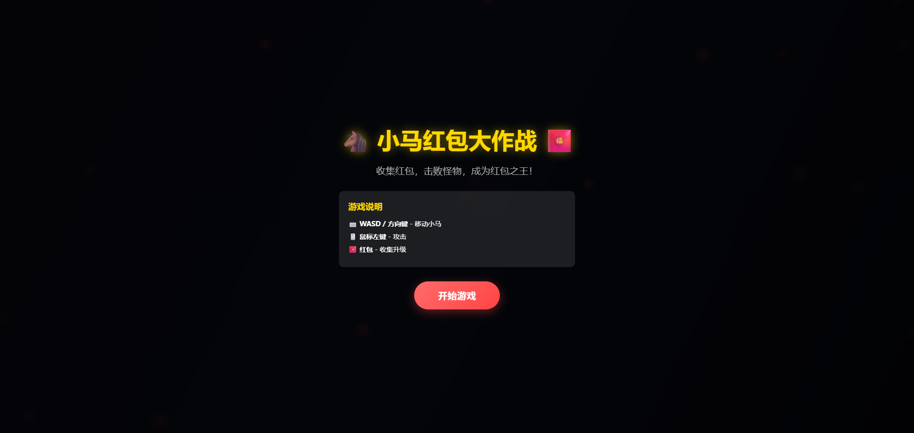
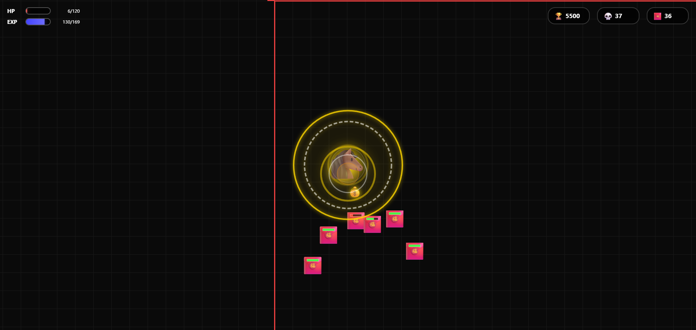
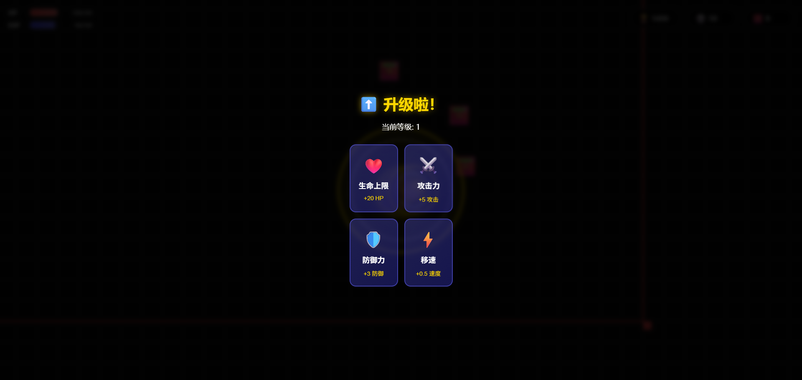
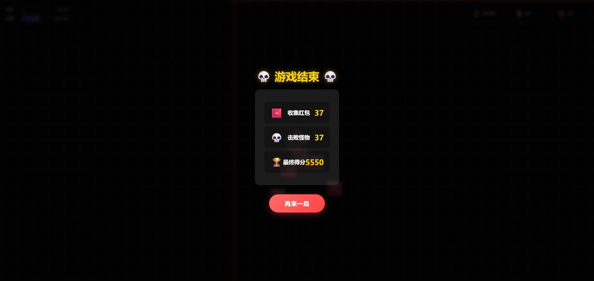

# 🐴 小马红包大作战

<div align="center">

**一款基于HTML/Canvas的暗黑刷宝类生存游戏**

[](https://github.com/204313508/pony-redpacket-survivor)
[](https://github.com/204313508/pony-redpacket-survivor)
[](LICENSE)



[English](#english) | [中文](#中文)

</div>

---

## 中文

### 🎮 游戏简介

《小马红包大作战》是一款受《吸血鬼幸存者》和《土豆兄弟》启发的暗黑刷宝类网页游戏。玩家控制一只小马，在不断涌来的红包怪围攻中生存，击败怪物收集红包，升级强化自己，挑战Boss，获得更高的分数！

### ✨ 游戏特色

- 🎯 **简单易上手** - WASD/方向键移动，鼠标左键攻击
- 🔥 **爽快的战斗体验** - 范围攻击，一次击中多个怪物
- 👹 **Boss挑战** - 每30秒出现强大的Boss，需要多次击败
- 💥 **自爆系统** - 怪物和Boss自爆造成伤害，考验走位
- 📈 **RPG成长系统** - 收集红包升级，提升四大属性
- 🎨 **精美的视觉效果** - 使用Emoji角色，炫酷的攻击特效
- 🚀 **流畅的游戏体验** - 纯HTML/CSS/JS实现，无需安装
- 💪 **挑战性** - 怪物随时间增强，越玩越刺激

### 🎯 游戏玩法

#### 控制方式
- **WASD / 方向键** - 移动小马
- **鼠标左键** - 范围攻击
- **收集红包** - 靠近红包自动收集

#### 升级系统
收集足够的红包（经验）后会触发升级，可以从四个属性中选择一项提升：
- ❤️ **生命上限** - +20 HP，同时恢复20点血量
- ⚔️ **攻击力** - +5 攻击
- 🛡️ **防御力** - +3 防御
- ⚡ **移速** - +0.5 速度

#### Boss系统
- **Boss生成**：每30秒生成一个强大的Boss
- **Boss特性**：
  - 比普通怪物更大更强
  - 可以多次自爆，每次自爆扣除自身等量血量
  - 自爆后需要冷却1.5秒
  - Boss死亡后掉落大量红包
- **挑战策略**：灵活走位，利用攻击间隙击败Boss

#### 怪物自爆
- 普通怪物撞击玩家时会自爆，造成伤害
- Boss可以多次自爆，需要多次击败
- 利用走位躲避自爆伤害

#### 游戏目标
- 尽可能长时间生存
- 击败更多红包怪和Boss
- 收集更多红包
- 获得更高分数

### 🚀 快速开始

#### 在线游玩
直接用浏览器打开 `index.html` 文件即可开始游戏！

#### 本地运行
```bash
# 克隆仓库
git clone https://github.com/204313508/pony-redpacket-survivor.git

# 进入目录
cd pony-redpacket-survivor

# 用浏览器打开 index.html
open index.html  # macOS
start index.html # Windows
xdg-open index.html # Linux
```

#### 使用本地服务器（推荐）
```bash
# 使用 Python 3
python -m http.server 8000

# 使用 Node.js
npx http-server

# 然后访问 http://localhost:8000
```

### 🛠️ 技术栈

- **HTML5** - 页面结构
- **CSS3** - 样式和动画
- **JavaScript (ES6+)** - 游戏逻辑
- **Canvas API** - 游戏渲染
- **requestAnimationFrame** - 动画循环

### 📁 项目结构

```
pony-redpacket-survivor/
├── index.html          # 游戏主页面
├── style.css           # 样式文件
├── game.js             # 游戏逻辑
├── README.md           # 项目说明
└── review.md           # 代码审查报告
```

### 🎮 游戏截图

#### 游戏开始界面
<div align="center">
  
</div>

#### 游戏战斗画面
<div align="center">
  
  
</div>

<div align="center">
  
</div>

#### 游戏结束界面
<div align="center">
  
</div>

### 📊 游戏参数

#### 玩家初始属性
| 属性 | 数值 |
|------|------|
| 生命值 | 100 |
| 攻击力 | 15 |
| 防御力 | 5 |
| 移速 | 4 |
| 攻击范围 | 150px |
| 攻击冷却 | 400ms |

#### 怪物属性
| 属性 | 数值 |
|------|------|
| 初始生命 | 30 |
| 初始攻击 | 10 |
| 初始速度 | 1.8 |
| 生成间隔 | 1.5秒 |
| 最大数量 | 30 |

#### Boss属性
| 属性 | 数值 |
|------|------|
| 初始生命 | 200 |
| 攻击力 | 20 |
| 移速 | 2.2 |
| 大小 | 60px |
| 生成间隔 | 30秒 |
| 自爆伤害 | 30 |
| 自爆冷却 | 1.5秒 |
| 死亡掉落红包 | 15个 |

#### 难度成长
- 每30秒难度增加 0.5倍
- 怪物属性随难度增强
- 生成数量随难度增加
- Boss属性也随难度增强

### 🎯 得分规则

- 击败普通怪物：+100分
- 击败Boss：+500分
- 收集红包：+50分
- 最终得分 = 普通击杀数×100 + Boss击杀数×500 + 收集数×50

### 🐛 已知问题

- 游戏在低性能设备上可能会有卡顿
- 部分旧版浏览器可能不支持Canvas API

### 🔄 未来计划

- [ ] 添加更多攻击技能
- [ ] 添加成就系统
- [ ] 添加排行榜
- [ ] 支持触摸屏操作
- [ ] 添加更多角色选择
- [ ] 添加更多Boss类型
- [ ] 优化性能

---

## English

### 🎮 Game Introduction

**Pony Red Packet Survivor** is a dark survival roguelike web game inspired by *Vampire Survivors* and *Potato Bros*. Control a pony, survive against waves of red packet monsters, collect red packets to level up, challenge powerful Bosses, and achieve a higher score!

### ✨ Game Features

- 🎯 **Easy to Play** - WASD/Arrow keys to move, Mouse to attack
- 🔥 **Exciting Combat** - Area-of-effect attacks, hit multiple enemies at once
- 👹 **Boss Challenges** - Powerful Bosses appear every 30 seconds, requiring multiple defeats
- 💥 **Explosion System** - Monsters and Bosses explode on impact, dealing damage
- 📈 **RPG Progression** - Collect red packets to level up and upgrade stats
- 🎨 **Beautiful Visuals** - Emoji-based characters, cool attack effects
- 🚀 **Smooth Experience** - Pure HTML/CSS/JS, no installation needed
- 💪 **Challenging** - Monsters get stronger over time

### 🎯 How to Play

#### Controls
- **WASD / Arrow Keys** - Move pony
- **Mouse Left Click** - Area attack
- **Collect Red Packets** - Get close to collect automatically

#### Upgrade System
Collect enough red packets (EXP) to level up, choose from four stats:
- ❤️ **Max HP** - +20 HP, also heals 20 HP
- ⚔️ **Attack Power** - +5 Attack
- 🛡️ **Defense** - +3 Defense
- ⚡ **Movement Speed** - +0.5 Speed

#### Boss System
- **Boss Spawn**: A powerful Boss appears every 30 seconds
- **Boss Features**:
  - Larger and stronger than normal monsters
  - Can explode multiple times, losing HP equal to explosion damage
  - 1.5 second cooldown after explosion
  - Drops many red packets upon death
- **Strategy**: Use positioning wisely, defeat Bosses during cooldown windows

#### Monster Explosions
- Normal monsters explode on impact, dealing damage
- Bosses can explode multiple times and require multiple defeats
- Dodge explosion damage with good positioning

#### Goal
- Survive as long as possible
- Defeat more red packet monsters and Bosses
- Collect more red packets
- Get a higher score

### 🚀 Quick Start

#### Play Online
Just open `index.html` in your browser and start playing!

#### Local Setup
```bash
# Clone the repository
git clone https://github.com/yourusername/pony-redpacket-survivor.git

# Navigate to directory
cd pony-redpacket-survivor

# Open index.html in browser
open index.html  # macOS
start index.html # Windows
xdg-open index.html # Linux
```

#### Using Local Server (Recommended)
```bash
# Using Python 3
python -m http.server 8000

# Using Node.js
npx http-server

# Then visit http://localhost:8000
```

### 🛠️ Tech Stack

- **HTML5** - Page structure
- **CSS3** - Styles and animations
- **JavaScript (ES6+)** - Game logic
- **Canvas API** - Game rendering
- **requestAnimationFrame** - Animation loop

### 📁 Project Structure

```
pony-redpacket-survivor/
├── index.html          # Main page
├── style.css           # Styles
├── game.js             # Game logic
├── README.md           # Project documentation
└── review.md           # Code review report
```

### 🎮 Game Screenshots

#### Game Start Screen
<div align="center">
  
</div>

#### Gameplay
<div align="center">
  
  
</div>

<div align="center">
  
</div>

#### Game Over Screen
<div align="center">
  
</div>

### 📊 Game Parameters

#### Player Initial Stats
| Stat | Value |
|------|-------|
| Health | 100 |
| Attack Power | 15 |
| Defense | 5 |
| Movement Speed | 4 |
| Attack Range | 150px |
| Attack Cooldown | 400ms |

#### Monster Stats
| Stat | Value |
|------|-------|
| Initial HP | 30 |
| Initial Attack | 10 |
| Initial Speed | 1.8 |
| Spawn Interval | 1.5s |
| Max Count | 30 |

#### Boss Stats
| Stat | Value |
|------|-------|
| Initial HP | 200 |
| Attack Power | 20 |
| Movement Speed | 2.2 |
| Size | 60px |
| Spawn Interval | 30s |
| Explosion Damage | 30 |
| Explosion Cooldown | 1.5s |
| Red Packet Drop | 15 |

#### Difficulty Progression
- Difficulty increases by 0.5x every 30 seconds
- Monster stats scale with difficulty
- Spawn count increases with difficulty
- Boss stats also scale with difficulty

### 🎯 Scoring Rules

- Defeat normal monster: +100 points
- Defeat Boss: +500 points
- Collect red packet: +50 points
- Final Score = Normal Kills × 100 + Boss Kills × 500 + Collections × 50

### 🐛 Known Issues

- Game may lag on low-performance devices
- Some older browsers may not support Canvas API

### 🔄 Future Plans
- [ ] Add more attack skills
- [ ] Add achievement system
- [ ] Add leaderboard
- [ ] Support touch controls
- [ ] Add more character options
- [ ] Add more Boss types
- [ ] Performance optimization
